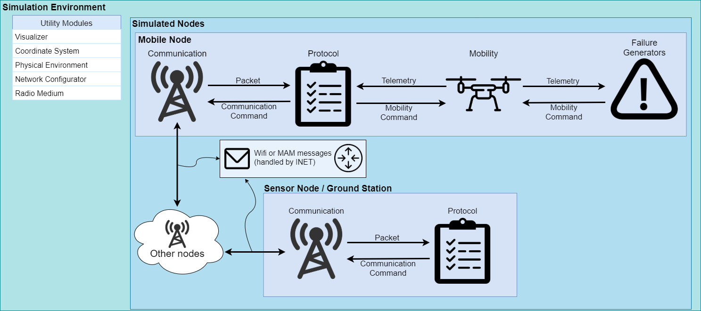
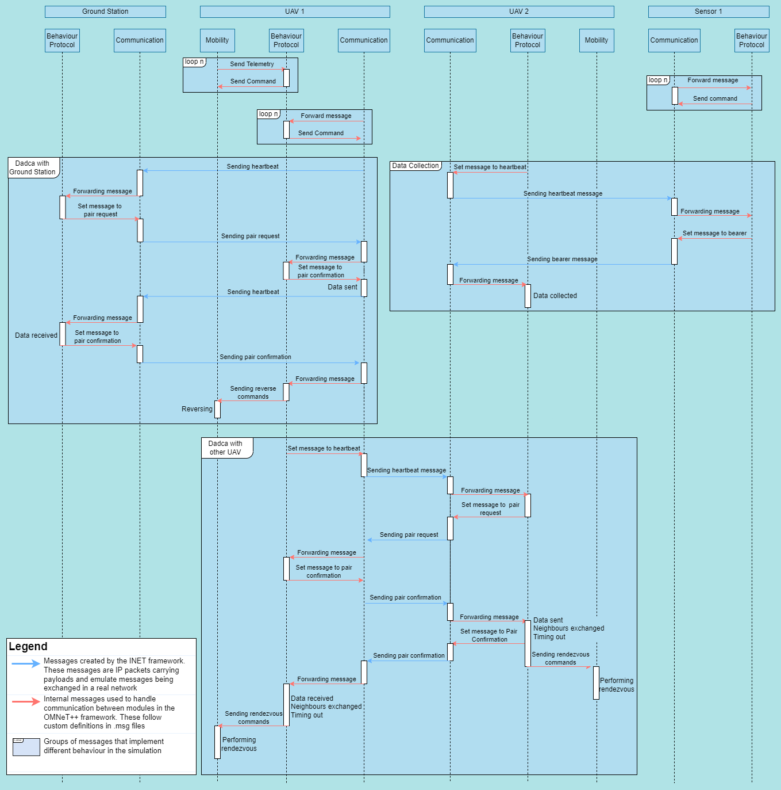
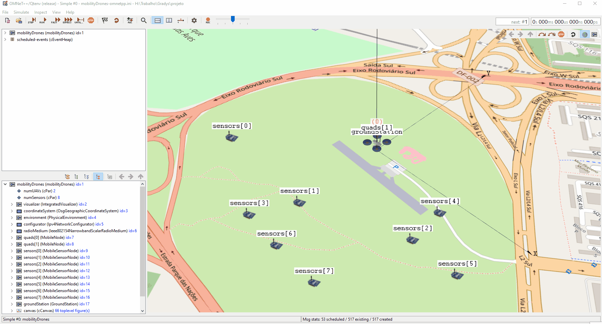

# Gradys Simulations
Simulations from Project GrADyS on OMNET++ and INET framework

# Introduction

This is a repository for the simulation framework developed for the GrADyS project. This framework allows the simulation of interconnected network nodes and the implementation of UAV swarms and sensor coordination strategies with the objective of managing these autonomous drone swarms to collect sensor data on the field autonomously and efficiently.


# Installation
In order to run the simulations and use the components in this repository you need to have both OMNeT++ and the INET framework installed.

Version 5.6 of OMNeT++ is required, to install it [just follow these instructions](https://doc.omnetpp.org/omnetpp/InstallGuide.pdf). INET version 4.2 is also required, when first opening the OMNeT++ IDE you should be prompted with the option to install INET and all you need to do is accept it but if you need help [check out the installation instructions](https://inet.omnetpp.org/Installation.html).

After installing both OMNeT++ and INET you should be able to clone the repository to youw active OMNeT++ IDE workspace. To do this select File > Impor... then open the "git" section and select "Projects from git" then "Clone Uri". After that just fill in the URL for this repository and finish the process following the displayed instructions.

# Usage
OMNeT++ simulations are initialized by *.ini* files. The already provided **mobilityDrones-omnetpp.ini** file contains some launch configurations for Wifi only communication and shared Wifi and MAM communication, each with configs for one to four drones. Launch configurations are defined in the same *.ini* file denoted by the [Config Sim2drone] tag where Sim2drone is the name of the launch configuration. The [Config Wifi] and [Config MAM] configs are base configs for the other ones and should not be ran.

Launch configurations dictate the parameters of your simulation and you can change **mobilityDrones-omnetpp.ini** to suit your necessities. Here are some of the more important parameters that you can try switching yourself:


The number of UAVs and sensors in the simulation:
```C++
*.numUAVs = 2 // Initializes the *.quad[] array with 2 UAVs
*.numSensors = 8 // Initializes the *.sensors[] array with 8 sensors
```


Some UAV (called quads in this file) parameters:
```C++
// The protocol the drone will follow (protocols explained further bellow)
// Change this to test other protocols like "ZigzagProtocol"
*.quads[*].protocol.typename = "DadcaProtocol" 

// The UAV's destination addresses (nodes it talks to and recieves messages from)
*.quads[0].app[0].destAddresses = "quads[1] sensors[0] sensors[1] sensors[2] groundStation"

// Start time for the UAV's communication and mobility modules
// Change this to expertiment with different start timings
*.quads[1].app[*].startTime = normal(40s, 1s) // Here the normal function gives a value 1s within 40s
*.quads[1].mobility.startTime = 40s

// The waypoint file the UAV should follow
*.quads[*].mobility.waypointFile = "paths/voo_ar.waypoints"
```


Some sensor parameters:
```C++
// The sensor's destination addresses
*.sensors[*].app[0].destAddresses = "quads[0] quads[1]"

// The protocol the sensor should follow
*.sensors[0..2].protocol.typename = "DadcaProtocolSensor"

// The sensor's position coordinates
*.sensors[0].mobility.initialLatitude = -15.84245230deg
*.sensors[0].mobility.initialLongitude = -47.92948720deg
```


To run a simulation simply select one of the *.ini* files and use the OMNeT++ IDE Run option. After the GUI opens select the desired launch configuration and press play on the simulation.


# Project Structure
## Diagrams
**Project Structure Diagram**


**Project Message Diagram**


INET offers a series of modules that control node mobility. Our objective was to create a module that was capable of simulating a very simple drone mobility model and could react to network events. This setup allows support for a wide array of possible drone coordination protocols.

The described requirement was achieved with three modules, one resposible for communication between drones (communication), one for controlling the node's movement (mobility) and the last to manage the interaction between the last two (protocol). The behaviour and implementation of these modules is detailed further below. They were made in such a way that the messages exchanged between them are sufficiently generic to allow the creation of a new protocol by creating a new protocol module, with no changes to the other ones by levaraging these generic messages to carry out different procedures. The messages exchanged between them are explained further bellow and are contained on *.msg* files like **MobilityCommand.msg**, **Telemetry.msg** and **CommunicationCommand.msg**.

These three modules are loaded in a *.ned* file. In OMNeT++ *.ned* files define modules that can use other modules forming a module tree. These modules can be simple (the leaves of the module tree) or a compound module that connects simple modules or other compound modules with gates. A network is a special kind of compound module that can be run as a simulation. 

The compound module that represents our UAVs is **MobileNode.ned** and **MobileSensorNode.ned** represents our sensors. These modules contain Communication and Mobility modules (defined in the extended module AdhocHost) and the Protocol module (defined in the file). The **mobilityDrones.ned** file connects all the UAVs(called quads), sensors and some other modules necessary to the simulation.

 ## Mobility
 The mobility module is responsible for controlling drone movement and responding to requests from the protocol module to change that movement through MobilityCommand messages. It also needs to inform the procol module about the current state of the drone's movement through Telemetry messages. 
 
 As part of the module initialization the waypoint list is attached to a Telemetry message so the protocol module has access to the tour the mobile node is following.
 
 These are the messages used:

* **MobilityCommand.msg**
```C++
// Commands that the mobility module should be capable of carrying out
enum MobilityCommandType {
    // Makes the drone reverse on its course
    // No params
    REVERSE=0; 
    
    // Makes the drone travel to a specific waypoint, following the tour pack
    // Param 1: Waypoint index
    GOTO_WAYPOINT=1;
    
    // Makes the drone go to a specific coordinate and orient itself so it can continue the tour afterwards
    // Param 1: x component of the coord
    // Param 2: y component of the coord
    // Param 3: z component of the coord
    // Param 4: Next waypoint (Waypoint the drone should go to after reaching the target)
    // Param 5: Last waypoint (Waypoint the drone used to reach the coords)
    GOTO_COORDS=2;
}

// Message declaration containing the command Id and its parameters 
message MobilityCommand {
    MobilityCommandType commandType;
    double param1=-1;
    double param2=-1;
    double param3=-1;
    double param4=-1;
    double param5=-1;
}
```
* **Telemetry.msg**
```C++
// Activity that the drone is currently carrying out
enum DroneActivity { 
    IDLE=0; 
    NAVIGATING=1;
    REACHED_EDGE=2; 
    FOLLOWING_COMMAND=3;
}

// Message declaration designed to share necessary drone information with the communication module
message Telemetry {
    int nextWaypointID=-1;
    int lastWaypointID=-1;
    int currentCommand=-1;
    bool isReversed=false;
    DroneActivity droneActivity;
}
```

The only mobility module currently implemented is **DroneMobility.ned** which simulates the movement of a drone. 

 An optional feature of the mobility module is attaching a failure generator module. They connect to the mobility module using the same gates the protocol module does and use that to send commands in order to simulate failures. This can be used to trigger random shutdowns and even to simulate energy consumption. An example of a module that simulates energy consumption is the SimpleEnergyConsumption, a parametrized component to simulate consumption and battery capacity. It sends RETURN_TO_HOME messages to the vehicle when the drone's battery reaches a certain threshold and shuts it down when the battery is depleted.

 Configuring the use of failures for your mobile nodes is easy. The *.failures[]* array can be used to add as many failure generators as needed and the number of failures can be configured using the *.numFailures* option.

 ```python
 # Configuring two types of failures for quads[0]

*.quads[0].numFailures = 2 # Two failures
*.quads[0].failures[0].typename="SimpleConsumptionEnergy" # The first one will use a simple energy consumption module
*.quads[0].failures[0].batteryCapacity = 5000mAh
*.quads[0].failures[0].batteryRTLThreshold = 4500mAh
*.quads[0].failures[0].batteryConsumption = 10A
*.quads[0].failures[0].rechargeDuration = 5s

*.quads[1].failures[1].typename="RanfomFailureGenerator" # The second will use a random failure generator
*.quads[1].failures[1].failureStart = 10s
*.quads[1].failures[1].failureMininumInterval = 40s
*.quads[1].failures[1].failureChance = 0.001
 ```

 ## Communication
 INET provides built in support for the simulation of real communications protocols and the communication module takes advantage of this to simulate communication between nodes. It also has to inform the protocol module of the messages being recieved by sharing the messages themselves and listen to orders from the protocol module through CommunicationCommands. Here are the messages used:
 
 * **CommunicationCommand.msg**
 ```C++
enum CommunicationCommandType {
    // Sets the payload that the communication module sends
    SET_PAYLOAD=0;
    // Sets the target of the communication message (null means broadcast)
    SET_TARGET=1;
}

// Message declaration for the communication command
message CommunicationCommand {
    CommunicationCommandType commandType;
    
    // Template for the SET_PAYLOAD message type (message that the communication module should send)
    inet::FieldsChunk *payloadTemplate;
    
    // Target for the set target command
    string target;
}
 ```

 The message module has several implementations. The *base* folder contains several base implementations for possible communication modules, these files contain functions that interface with INET's communication capabilities but don't implement interaction with any other module.
 
 These files were used as base for the implementation of the communication modules. The following files are the implementations used in the simulations:
  * **UdpMobileNodeCommunicationApp.ned**
  
    Manages the communication between mobile nodes and between mobile nodes and sensors.
 * **UdpSensorCommunicationApp.ned**
    
    Manages communication between sensors and mobile nodes.

## Protocol 
The protocol module manages the interaction between the movement and communication of the mobile nodes. It makes use of the messages provided by it's two sibling modules to create node interaction strategies. It mostly reacts to messages it recieves from those modules and determines which orders to give them to achieve the desired result.

It gathers information about the current state of the simulation by analysing Telemetry messages recieved from the Mobility module and Packets forwarded to it by the Communication module. An important task it performs is the definition of the message sent by the Communication module. These messages will be sent to other nodes that will themselves handle them. The messages are inserted into IP Packages as payload. They can have different formats depending on the protocol being implemented. Here is the **DadcaMessage.msg** used by the Dadca protocol, for example.

* **DadcaMessage.msg**
```C++
enum DadcaMessageType
{
  HEARTBEAT = 0; 
  PAIR_REQUEST = 1; 
  PAIR_CONFIRM = 2;
  BEARER = 3;
}

class DadcaMessage extends FieldsChunk
{
  chunkLength = B(34); // Fixed chunk length
  int sourceID = -1;  // ID of the message's source
  int destinationID = -1; // ID of the message's destination
  int nextWaypointID = -1; // ID of the next waypoint
  int lastWaypointID = -1; // ID of the last waypoint
  int dataLength = 5; // Length of the imaginary data being carried in the message
  int leftNeighbours = 0; // Neighbours to the left of the drone
  int rightNeighbours = 0; // Neighbours to the right of the drone
  bool reversed = false; // Reverse flag which indicates the current direction the drone is travelling in
  DadcaMessageType messageType = HEARTBEAT; // Type of message
}
```

Protocools implement an IProtocol interface and extend  **CommunicationProtocolBase.ned** which provides useful stub functions to use when implementing protocols. These functions are as follows:
```C++
// Redirects message to the proper function
virtual void handleMessage(cMessage *msg);

// Handles package received from communication
// This packet is a message that was sent to the drone
virtual void handlePacket(Packet *pk) {};

// Handles telemetry received from mobility
// The mobility module exchanges mobility information in the form of telemetry
virtual void handleTelemetry(Telemetry *telemetry) {};

// Sends command to mobility
virtual void sendCommand(MobilityCommand *order);
// Sends command to communication
virtual void sendCommand(CommunicationCommand *order);

// Sets a timeout
virtual void initiateTimeout(simtime_t duration);
// Checks if the module is timed out
virtual bool isTimedout();
```

These are the currently implemented protocols:

* **ZigZagProtocol.ned** and **ZigZagProtocolSensor.ned**

     These files implement the mobile node and the sensor side of the ZigZag protocol. This prococol manages a group of drones folowwing a set path passing above several sensors from where they pick up imaginary data from those sensors. The drones also interact with each other sending several messages to coordinate their movement.

     Heartbeat messages are sent on a multicast address, if these are picked up by sensors they respond with data. If they are picked up by other drones they initiate a communication pair by sending a Pair Request message which is them confirmed by the other drone with a Pair Confirmation message. The drone furthest away from the starting point of the path sends its data to the other drone in the pair and they both reverse their movement. The objective is that over time the drones will each occupy an equally sized section of the course, picking up data on the way and sharing it at their section's extremities.

* **DadcaProtocol.ned** and **DadcaProtocolSensor.ned**
     
     This protocol is similar to the ZigZagProtocol. It also manages data collection by mobile nodes in a set path. The difference is that this method aims to speed up the process of equally spacing the drones in the course by implementing a more advanced movement protocol.

     When the Pair Confirmation message is recieved by both drones, confirming the pair, both drones take note of the number of neighours on their left (closer to the start) and their right (further from the start) and share this information with their pair. Both update their neighbour count and use it to calculate a point in the course that would represent the extremity of both their sections if their current count of neighbours is accurate. Them they both travel together to this point and revert. This behaviour is implemented with a sequence of commands that get queued on the mobility module.
    

# Development
To develop new protocols, you will probably be creating new protocol modules that use the current message definitions and commands to implement new behaviour and management and data collection strategies. If the current set of commands and messages is not enough you are free to add more by modifying the message definitions and the modules so that they can properly react to these new messages.

After creating a new module all you need to do to test it is modifying the desired *.ini* configuration to load your protocol. The protocol module is flexible and can be loaded with any implemented protocol by changing it's typename, for example:
```C++
*.quads[*].protocol.typename = "DadcaProtocol"
```

## Developing your own communication protocol

In this example we will develop a very simple protocol for our drones and sensors. Our drones will follow their waypoint paths without communication with each other, collecting data from sensors and depositing it at a central ground station. We will create sets of files (*.ned*, *.h* and *.cc*), **SimpleDroneProtocol**, **SimpleSensorProtocol** and **SimpleGroundProtocol** and a message declaration **SimpleMessage.msg**. For your convenience these files have already been created and placed in their respective folders, and the configuration file includes a launch config for this scenario.

Let's start with the message. Since this protocol is very simple we will implement a message with two fields, senderType and content. 

**SimpleMessage.msg**
```C++
// communication/messages/network/SimpleMessage.msg

// Network messages need to extend from the FieldsChunk class or other chunk classes
import inet.common.packet.chunk.Chunk;

namespace inet;

enum SenderType
{
  DRONE = 0;
  SENSOR = 1;
  GROUND_STATION = 2;
}

class SimpleMessage extends FieldsChunk
{
    chunkLength = B(7); // Fixed chunk length
    SenderType senderType;
    int content;
}
```

Our protocols will use this message definition to communicate with eachother. Next let's define our drone's protocol. All it needs to do is contantly emit messages with it's current data load, listen to messages from sensors to load more data and listen to messages from the groundStation to unload. The only parameter we are defining is the timeoutDuration, we will not override the default value but it is good to have the option to increase or decrease the drone's timeout. This timeout will be activated to prevent over-communication with the sensors and ground station.

**SimpleDroneProtocol.ned**
```C++
// communication/protocols/mobile/SimpleDroneProtocol.ned

package projeto.communication.protocols.mobile;

import projeto.communication.protocols.base.CommunicationProtocolBase;

simple SimpleDroneProtocol extends CommunicationProtocolBase
{
    parameters:
        @class(SimpleDroneProtocol);
        @signal[dataLoad](type=long); // Declaration of dataLoad signal used to track current data load that the drone is carrying
        double timeoutDuration @unit(s) = default(3s);
}
```

Note that we also included a signal declaration called dataLoad. Signals are messages that bubble up the module tree and can be used to track information from modules deeper in the tree. In this case whe have configured a statistic visualizer (provided by INET) to show this signal's state on the simulation screen.

**mobilityDrones-omnetpp.ini**
```C++
*.visualizer.*.statisticVisualizer.signalName = "dataLoad" # Signal name
*.visualizer.*.statisticVisualizer.format = "(%v)"
*.visualizer.*.statisticVisualizer.textColor = "red"
*.visualizer.*.statisticVisualizer.font = "Courier New, 12px, bold"
*.visualizer.*.statisticVisualizer.opacity = 1
*.visualizer.*.statisticVisualizer.sourceFilter = "*.quads[*].** *.groundStation.**"
```

Next we need to add code to our drone module to simulate the required behaviours. Since our simple behavour only includes responding to messages from other nodes, we will only need to override the *initialize* and *handlePacket* functions. We will also create a updatePayload function that will update our message to include the current data content we collected. 

**SimpleDroneProcol.h**
```C++
// communication/protocols/mobile/SimpleDroneProtocol.h

#include <omnetpp.h>
#include "../base/CommunicationProtocolBase.h"
#include "../../messages/network/SimpleMessage_m.h"

namespace projeto {

class SimpleDroneProtocol: public CommunicationProtocolBase {
    protected:
        simtime_t timeoutDuration;
        int content = 0;
    protected:
        // Performs the initialization of our module. This is a function that most OMNeT++ modules will override
        virtual void initialize(int stage) override;
        // Gets called when a packet is recieved from the communication module
        virtual void handlePacket(Packet *pk) override;
        // Helper function that updates packet content with the current collected data
        virtual void updatePayload();
};

} /* namespace projeto */
```

Our implementation of this header file is also very simple. Our initialization function will perform some startup tasks like setting our initial message and emitting a dataLoad signal so that the initial data load (0) will be displayed by the statistic visualizer described above. The drone will increase it's content count every time it encounters another sensor message and transfer all it's data when it encounters a ground station message. Note: the *par* function loads the value specified in the *.ned* of *ini* files for that parameter.

**SimpleDroneProtocol.cc**
```C++
// communication/protocols/mobile/SimpleDroneProtocol.cc

#include "SimpleDroneProtocol.h"
#include "inet/common/ModuleAccess.h"
#include "inet/common/TagBase_m.h"
#include "inet/common/TimeTag_m.h"
#include "inet/common/packet/Packet.h"

namespace projeto {
Define_Module(SimpleDroneProtocol);

void SimpleDroneProtocol::initialize(int stage) {
    // Loading the parameter timeoutDuration
    timeoutDuration = par("timeoutDuration");

    // Emits the first dataLoad signal with value 0
    emit(registerSignal("dataLoad"), content);

    // Updates the payload so the drone can start sending messages
    updatePayload();
}

void SimpleDroneProtocol::handlePacket(Packet *pk) {
    // Loads the SimpleMessage from the recieved packet
    auto message = pk->peekAtBack<SimpleMessage>(B(7), 1);

    if(message != nullptr) {
        switch(message->getSenderType()) {
            case DRONE:
            {
                std::cout << "Message recieved from drone, ignoring." << endl;
                break;
            }
            case SENSOR:
            {
                if(!isTimedout()) {
                    content += message->getContent();
                    // Emits signal and updates payload on data content change
                    emit(registerSignal("dataLoad"), content);
                    updatePayload();

                    initiateTimeout(timeoutDuration);
                }
                break;
            }
            case GROUND_STATION:
            {
                if(content != 0 && !isTimedout()) {
                    content = 0;
                    // Emits signal and updates payload on data content change
                    emit(registerSignal("dataLoad"), content);
                    updatePayload();

                    initiateTimeout(timeoutDuration);
                }
                break;
            }
        }
    }
}

void SimpleDroneProtocol::updatePayload() {
    // Creates message template with current content and correct type
    SimpleMessage *payload = new SimpleMessage();
    payload->addTag<CreationTimeTag>()->setCreationTime(simTime());
    payload->setSenderType(DRONE);
    payload->setContent(content);

    // Sends command to the communication module to start using this message
    CommunicationCommand *command = new CommunicationCommand();
    command->setCommandType(CommunicationCommandType::SET_PAYLOAD);
    command->setPayloadTemplate(payload);
    sendCommand(command);
}

} /* namespace projeto */
```

Next comes our sensor implementation. Here is the *.ned* file for our sensors:

**SimpleSensorProtocol.ned**
```C++
// communication/protocols/sensor/SimpleSensorProtocol.ned

package projeto.communication.protocols.sensor;

import projeto.communication.protocols.base.CommunicationProtocolBase;

simple SimpleSensorProtocol extends CommunicationProtocolBase
{
    parameters:
        @class(SimpleSensorProtocol);
        int payloadSize = default(5);
}
```

As you can see the file is very similar to the drone's *.ned* file. The only big change is that our *timeoutDuration* parameter has been switched out for a *payloadSize* one. Our sensor is a passive listener so it doens't need a timeout. The payloadSize parameter defines the amound of data the sensor sends to the drone during each communication. We will keep this at the default value 5 but you are free to change it.

**SimpleSensorProcol.h**
```C++
// communication/protocols/sensor/SimpleSensorProcol.h

#include <omnetpp.h>
#include "../base/CommunicationProtocolBase.h"
#include "../../messages/network/SimpleMessage_m.h"

namespace projeto {

class SimpleSensorProtocol: public CommunicationProtocolBase {
    protected:
        int payloadSize;
    protected:
        // Initialization function
        virtual void initialize(int stage) override;

        // Handles packet recieved from the drone
        virtual void handlePacket(Packet *pk) override;
};

} /* namespace projeto */
```

**SimpleSensorProcotol.cc**
```C++
// communication/protocols/sensor/SimpleSensorProtocol.cc

namespace projeto {
Define_Module(SimpleSensorProtocol);

void SimpleSensorProtocol::initialize(int stage) {
    // Loading payload size parameter
    payloadSize = par("payloadSize");

    // Sets the correct payload
    SimpleMessage *payload = new SimpleMessage();
    payload->addTag<CreationTimeTag>()->setCreationTime(simTime());
    payload->setSenderType(SENSOR);
    payload->setContent(payloadSize);

    CommunicationCommand *command = new CommunicationCommand();
    command->setCommandType(CommunicationCommandType::SET_PAYLOAD);
    command->setPayloadTemplate(payload);
    sendCommand(command);
}

void SimpleSensorProtocol::handlePacket(Packet *pk) {
    // Loading message from packet
    auto message = pk->peekAtBack<SimpleMessage>(B(7), 1);

    if(message != nullptr) {
        switch(message->getSenderType()) {
            case DRONE:
            {
                // Sets the correct target
                CommunicationCommand *targetCommand = new CommunicationCommand();
                targetCommand->setCommandType(CommunicationCommandType::SET_TARGET);
                targetCommand->setTarget(pk->getName());
                sendCommand(targetCommand);
                break;
            }
            case SENSOR:
            {
                break;
            }
            case GROUND_STATION:
            {
                break;
            }
        }
    }
} /* namespace projeto */
```

When the sensor recieves messages from the drones they will set the drone as a target (setting a target prevents the message from being broadcasted). The sensor's message is always the same, the only thing that changes is the target. The **UdpSensorCommunicationApp** communication module is programmed to be a passive communication module, that means that it doesn't send constant messages like the **UdpMobileNodeCommunicationApp**, it only sends messages when a new target or payload is set.

Last is the ground station. The ground station needs to listen to messages from drones and collect the data they are carrying and send a confirmation message back to the so they can empty their data load.

**SimpleGroundProtocol.ned**
```C++
// communication/protocols/ground/SimpleGroundProtocol.ned

package projeto.communication.protocols.ground;

import projeto.communication.protocols.base.CommunicationProtocolBase;

simple SimpleGroundProtocol extends CommunicationProtocolBase
{
    parameters:
        @class(SimpleGroundProtocol);
        @signal[dataLoad](type=long); // Declaration of dataLoad signal used to track current data load that the drone is carrying
}
```

The ground station itself needs no parameters but it does need the dataLoad signal declaration so that it can properly display it's collected data. The implementation bellow is very similar to the sensor's code, the only thing changing is the message sender type.

**SimpleGroundProtocol.h**
```C++
// communication/protocols/ground/SimpleGroundProtocol.h

#include <omnetpp.h>
#include "../base/CommunicationProtocolBase.h"
#include "../../messages/network/SimpleMessage_m.h"

namespace projeto {

class SimpleGroundProtocol: public CommunicationProtocolBase {
    protected:
        int content = 0;
    protected:
        virtual void initialize(int stage) override;
        virtual void handlePacket(Packet *pk) override;
};

} /* namespace projeto */
```

**SimpleGroundProtocol.cc**
```C++
// communication/protocols/ground/SimpleGroundProtocol.cc

namespace projeto {
Define_Module(SimpleGroundProtocol);

void SimpleGroundProtocol::initialize(int stage) {
    emit(registerSignal("dataLoad"), content);

    // Sets the correct payload
    SimpleMessage *payload = new SimpleMessage();
    payload->addTag<CreationTimeTag>()->setCreationTime(simTime());
    payload->setSenderType(GROUND_STATION);
    payload->setContent(0);

    CommunicationCommand *command = new CommunicationCommand();
    command->setCommandType(CommunicationCommandType::SET_PAYLOAD);
    command->setPayloadTemplate(payload);
    sendCommand(command);
}

void SimpleGroundProtocol::handlePacket(Packet *pk) {
    auto message = pk->peekAtBack<SimpleMessage>(B(7), 1);

    if(message != nullptr) {
        switch(message->getSenderType()) {
            case DRONE:
            {
                content += message->getContent();
                // Emits signal on data content change
                emit(registerSignal("dataLoad"), content);

                // Sets the correct target
                CommunicationCommand *targetCommand = new CommunicationCommand();
                targetCommand->setCommandType(CommunicationCommandType::SET_TARGET);
                targetCommand->setTarget(pk->getName());
                sendCommand(targetCommand);
                break;
            }
            case SENSOR:
            {
                break;
            }
            case GROUND_STATION:
            {
                break;
            }
        }
    }
} /* namespace projeto */
```

After developing all our protocols, including *.ned* declarations and *.h* and *.cc* implementations and creating (or using an existing) message type, all that is left is creating a launch configuration that uses our protocol. This launch configuration is already in the **mobilityDrones-omnetpp.ini** file as [Config Simple]

```
[Config Simple]
# Sets the description of the launch configuration.
# Shown when you launch a simulation and are prompted to select the correct launch configuration.
description = "simple protocol configuration"

# UAV Configurations
# This parameter is declared in the mobilityDrones.ned network and defines the number of UAVs
# in the simulation.
*.numUAVs = 2

# Apps are user implemented modules that extend the behaviour of INET communication modules.
# In this case our app will be the communication part of our three part solution.
*.quads[*].numApps = 1

# The communbication module automatically filters messages from nodes that are not included in the
# destAddresses parameter. Be careful not to set the node as a destination address to itself.
*.quads[0].app[0].destAddresses = "quads[1] sensors[0] sensors[1] sensors[2] groundStation"
*.quads[1].app[0].destAddresses = "quads[0] sensors[0] sensors[1] sensors[2] groundStation"

# The waypointFile parameter is declared in DroneMobility.ned and specifies the waypoint list
# the drones will follow.
*.quads[0].mobility.waypointFile = "paths/voo_sensor1.waypoints"
*.quads[1].mobility.waypointFile = "paths/voo_sensor2.waypoints"

# The typename parameter of the protocol specifies the filename of the protocol implementation
# the protocol module will use.
*.quads[*].protocol.typename = "SimpleDroneProtocol"

# The normal() function gives us a value within 1s of 1s. This is used instead of a fixed value
# because if both the quads communication apps started at 1s and had the same interval between
# messages (defined by the .sendInterval parameter) they would be forever syncronized and their
# messages would always interfere with each other in the medium.
*.quads[0].app[*].startTime = normal(1s, 1s)
*.quads[1].app[*].startTime = normal(1s, 1s)

# Sensor configurations
*.sensors[*].app[*].destAddresses = "quads[0] quads[1]"
*.sensors[0..2].protocol.typename = "SimpleSensorProtocol"

# Groundstation configurations
# Setting the ground station as a sensor because it is a passive listener in this config
*.groundStation.app[0].typename = "UdpSensorCommunicationApp"
*.groundStation.app[*].destAddresses = "quads[0] quads[1]"
*.groundStation.protocol.typename = "SimpleGroundProtocol"
*.groundStation.app[0].startTime = 0s
```

With all that you should be able to run the simulation and after selecting "Simple" as a launch configuration you will see the drones and sensors performing the described behaviour.

If you did everything right you should be seeing something like this:



---

You can find additinal information about this developing enviroment on the [OMNeT++](https://omnetpp.org/documentation/) and [INET](https://inet.omnetpp.org/docs/) documentations. Sometimes some classes or functions are not that well documented, in that case looking at the samples and tutorials included with INET and OMNeT++ can be a useful resource and if even that doesn't help you can easily look at INET's source code as it should be included in your workspace if you installed it correctly.